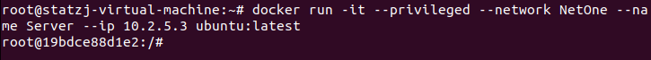

# SYN Flood DOS Attack

## 1. Create NetOne Network
    docker network create --subnet 10.2.5.0/24 NetOne --driver bridge
&emsp;
## 2. Launch Server Container in Privileged Mode
    docker run -it --privileged --network NetOne --name Server --ip 10.2.5.3 ubuntu:latest
&emsp;
## 3. Disable SYN Cookies on The Server Container
    sysctl -a | grep syncookies (Display the SYN cookie flag)
    sysctl -w net.ipv4.tcp_syncookies=0 (turn off SYN cookie)
    sysctl -p (restart sysctl)
    sysctl -a | grep syncookies (sanity check, make sure =0)
&emsp;
## 4. Launch Client and Attacker Containers
    docker run -it --network NetOne --name Client --ip 10.2.5.2 ubuntu:latest
    docker run -it --network host --name Attacker ubuntu:latest
&emsp;
&emsp;
## 5. Create NetCat Listener on Server Container
    nc -l 80 -v (Run from server)
&emsp;
## 6. Launch Attack From Attacker Container
    Python3 SYN_Flood.py
&emsp;
## 7. Connect Client to Server
    telnet 10.2.5.3 80 (Run from client)
&emsp;

